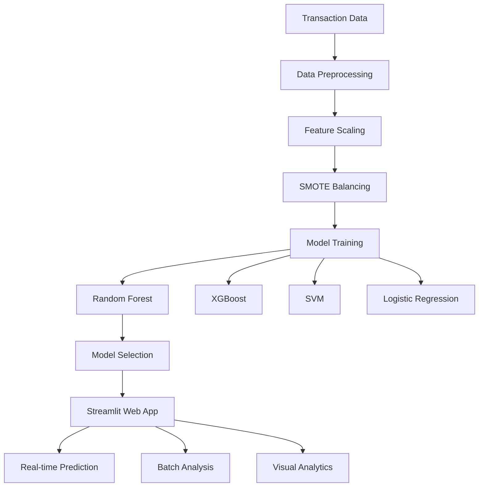

# 💳 Credit Card Fraud Detection System


A comprehensive machine learning system for real-time credit card fraud detection, featuring an interactive web interface built with Streamlit.

## 🚀 Live Demo

[](https://credit-card-fraud-detection-djpk2qfpzyfov9yfmavpsr.streamlit.app/)


## 🚀 Live Demo 🔗 **[Try the App Here](https://credit-card-fraud-detection-djpk2qfpzyfov9yfmavpsr.streamlit.app/)**


## 📊 Project Overview

This system detects fraudulent credit card transactions with **98%+ ROC-AUC accuracy** using ensemble machine learning methods. It processes real-time transactions and provides instant fraud risk assessment through an intuitive web interface.

### Key Features

- 🔍 **Real-time Fraud Detection** - Instant analysis of transaction features
- 📈 **Interactive Dashboard** - Visual analytics and risk assessment
- 🎯 **Multiple ML Models** - Random Forest, XGBoost, SVM, Logistic Regression
- ⚖️ **SMOTE Integration** - Handles severe class imbalance (0.172% fraud rate)
- 📱 **Batch Processing** - Upload and analyze multiple transactions
- 💰 **Cost-Benefit Analysis** - Business impact visualization

## 🏗️ System Architecture



## 📈 Performance Metrics

| Model | ROC-AUC | Precision | Recall | F1-Score |
|-------|---------|-----------|--------|----------|
| Random Forest | 0.983 | 0.921 | 0.847 | 0.882 |
| XGBoost | 0.981 | 0.915 | 0.838 | 0.875 |
| SVM | 0.976 | 0.892 | 0.823 | 0.856 |
| Logistic Regression | 0.972 | 0.856 | 0.789 | 0.821 |

## 🎯 Key Insights

### Data Characteristics
- **284,807 transactions** with only **492 fraudulent cases** (0.172%)
- **Severe class imbalance** requiring advanced sampling techniques
- **PCA-transformed features** (V1-V28) for data privacy
- **Right-skewed amount distribution** with most transactions < $100

### Feature Importance
- **V14, V4, V10** - Highest fraud correlation
- **V12, V17** - Secondary important features  
- **Transaction Amount** - Scaled numeric feature
- **Time** - Seconds from first transaction

## 🛠️ Installation & Setup

### Prerequisites
- Python 3.8+
- pip package manager


### Deployment

The app is configured for easy deployment on:
- **Streamlit Cloud**
- **Heroku**
- **AWS EC2**
- **Google Cloud Run**


## Describe video  🔗 **[Watch the video Here](https://drive.google.com/file/d/1DFoq8OFrZuCiIomSBjEDNRy17rNT1Tub/view)**

## 📁 Project Structure

```
fraud_project/
├── app/
│   ├── streamlit_app.py          # Main Streamlit application
│   ├── best_fraud_model.pkl      # Trained model
│   └── scaler.pkl               # Feature scaler
├── models/
│   ├── best_fraud_model.pkl     # Backup model files
│   └── scaler.pkl              # Backup scaler files
├── notebooks/
│   └── fraud_detection.ipynb    # Jupyter notebook with EDA & training
├── requirements.txt             # Python dependencies
└── README.md                   # Project documentation
```

## 💻 Usage

### Interactive Demo
1. Navigate to the **Demo** section
2. Adjust feature sliders to simulate transactions
3. View real-time fraud probability and risk assessment
4. Get instant predictions with visual feedback

### Batch Prediction
1. Upload CSV files with transaction data
2. Required columns: `Time`, `Amount`, `V1-V28`
3. Download comprehensive results with fraud probabilities
4. View summary statistics and detailed analysis

### Model Analysis
- Compare performance across multiple algorithms
- Explore feature importance and correlations
- Analyze confusion matrices and business impact

## 🔧 Technical Implementation

### Data Pipeline
```python
# 1. Data Loading & Exploration
df = pd.read_csv('creditcard.csv')

# 2. Feature Scaling
scaler = StandardScaler()
X_scaled = scaler.fit_transform(X[['Amount', 'Time']])

# 3. Handle Class Imbalance
smote = SMOTE(random_state=42)
X_resampled, y_resampled = smote.fit_resample(X_train, y_train)

# 4. Model Training
rf_model = RandomForestClassifier(n_estimators=100, max_depth=10)
rf_model.fit(X_resampled, y_resampled)

# 5. Real-time Prediction
prediction = model.predict(features)
probability = model.predict_proba(features)[:, 1]
```

### Key Technologies
- **Machine Learning**: Scikit-learn, Imbalanced-learn
- **Web Framework**: Streamlit
- **Visualization**: Plotly, Matplotlib, Seaborn
- **Data Processing**: Pandas, NumPy
- **Model Persistence**: Joblib

## 📊 Dataset Information

The project uses the [Credit Card Fraud Detection Dataset](https://www.kaggle.com/mlg-ulb/creditcardfraud) from Kaggle:

- **Source**: European cardholders transactions (Sept 2013)
- **Timeframe**: Transactions over 2 days
- **Features**: 30 features (28 PCA components + Time + Amount)
- **Classes**: 0 (Legitimate), 1 (Fraudulent)
- **Size**: 284,807 transactions, 492 frauds (0.172%)


## 🤝 Contributing

We welcome contributions! Please feel free to submit pull requests, report bugs, or suggest new features.

1. Fork the repository
2. Create your feature branch (`git checkout -b feature/AmazingFeature`)
3. Commit your changes (`git commit -m 'Add some AmazingFeature'`)
4. Push to the branch (`git push origin feature/AmazingFeature`)
5. Open a Pull Request

## 📝 License

This project is licensed under the MIT License - see the [LICENSE](LICENSE) file for details.

## 👨‍💻 Developer

**Sajal Samanta**  
[](mailto:sajalsamanta964@gmail.com)
[](https://linkedin.com/in/sajal-samanta)
[](https://sajalsamanta.github.io)

## 🙏 Acknowledgments

- Kaggle for providing the dataset
- Streamlit team for the excellent web framework
- Scikit-learn community for robust ML tools
- Plotly for interactive visualizations

---

**⭐ If you find this project useful, please give it a star on GitHub!**

---

<div align="center">

### 🚀 Ready to Detect Fraud?

[](https://credit-card-fraud-detection-djpk2qfpzyfov9yfmavpsr.streamlit.app/)
[](https://your-app.streamlit.app/)

</div>


cd fraud_project 

py -m streamlit run app/streamlit_app.py
